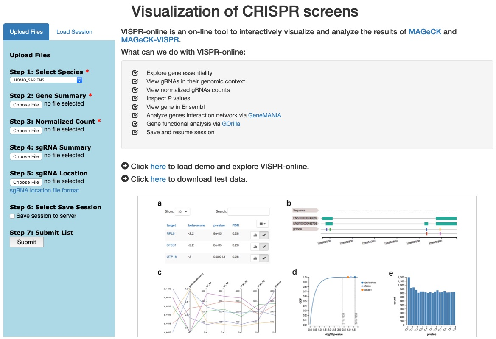
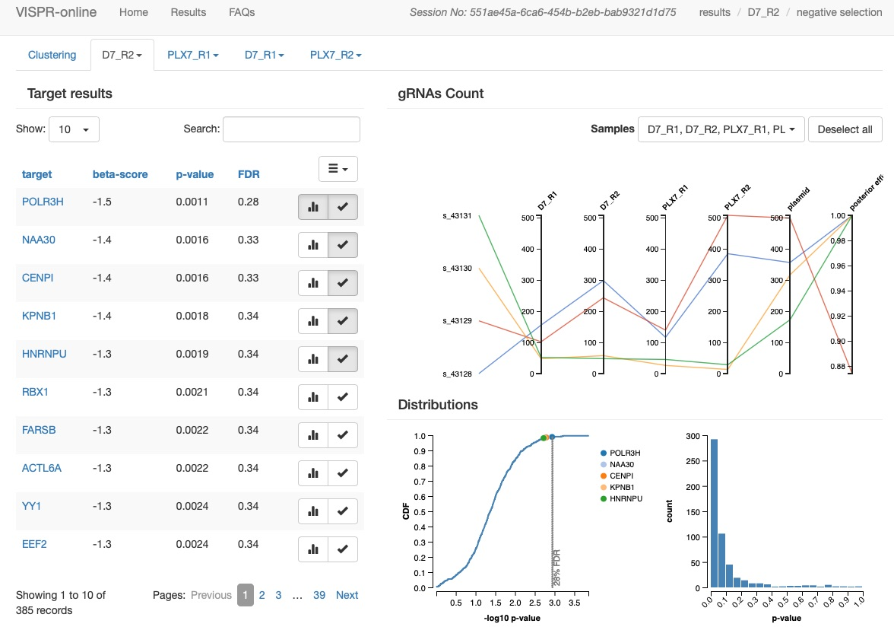

# VISPR-online
VISPR-online is a web-based interactive framework for CRISPR screens visualization, exploration and sharing.

#### Table of Contents
1. [Description](#Description)
2. [Installation](#Installation)
3. [Demo Test](#Demo)
4. [License](#License)
5. [Contact](#Contact)

<a name="Description"></a>
I. Description
----
VISPR-online is a web-based interactive framework for CRISPR screens visualization, exploration and sharing.

CRISPR screening helps systematically exploration of the functions of coding and non-coding elements in a genome. We previously developed [MAGeCK](https://www.ncbi.nlm.nih.gov/pubmed/25476604) and [MAGeCK-VISPR](https://www.ncbi.nlm.nih.gov/pubmed/26673418) to perform CRISPR screening data analysis. VISPR is a visualization tool included in [MAGeCK-VISPR](https://www.ncbi.nlm.nih.gov/pubmed/26673418), which can be used to explore interesting genes. However, VISPR is designed for local use and some manual configutations need be set to run the program. To help the community to access the tool easily, we improve the tool and develop an online version: VISPR-online.

The advantages of VISPR-online compared with VISPR:

* Installation and configuration free. Easy to access via a browser.
* Support interactive view of sgRNA locations in the gene context.
* Enable to resume and share data and sessions.

<a name="Installation"></a>
II. Installation
----
VISPR-online can also be installed in a local computer or network for internal use.

### Step1:
Download VISPR-online source code.

```
$ git clone https://github.com/lemoncyb/VISPR-online.git
```

### Step2:
To install VISPR-online you have to use the Python 3 variant of the Miniconda Python distribution (http://conda.pydata.org/miniconda.html). VISPR-online cannot be installed on the Python 2 variant of Miniconda. When installing Miniconda, make sure that you answer yes to this question:
```
Do you wish the installer to prepend the Miniconda3 install location to PATH ...? [yes|no]
```
Also, make sure that you do not have set the PYTHONPATH environment variable, because it will interfere with the Miniconda setup.
You can create an isolated software environment for vispr-online by executing using the terminal or an Anaconda Prompt:
```
$cd VISPR-online
$conda env create -f environment.yml
```
Then, activate the environment by running
```
$conda activate vispr-online
```
conda activate and conda deactivate only work on conda 4.6 and later versions. For conda versions prior to 4.6, run:

Windows: activate or deactivate

Linux and macOS: source activate or source deactivate

III. Demo test
----
### Step1:
Launch VISPR-online server.

Enter the top directory of VISPR-online. Execute the following script:

Windows:
```
$python ./run.py
```
Linux and macOS: 
```
$ ./run.py
```

Open your browser and access <http://127.0.0.1:5000>. You will see the following page if successful.

 

### Step2:
A demo is integrated in VISPR-online repository. You could click the demo link on home page to load the project and explore the results.

### Step3:
A test dataset is contained in VISPR-online repository. The path is ```VISPR-online/vispr_screen/static/data/testdata.zip```. The dataset contains the following files:

* **mle.gene_summary.txt:** gene summary file.
* **all.count_normalized.txt:** normalized count file.
* **mle.sgrna_summary.txt:** sgRNA summary file.
* **sgrnas.bed:** sgRNA location file.
* **README.txt:** README file.

Upload corresponding files to VISPR-online. Then click the "Submit" button to explore the results. The results pages are like this.

  

<a name="License"></a>
License
----
Licensed under the [MIT license](http://opensource.org/licenses/MIT). This project may not be copied, modified, or distributed except according to those terms.

<a name="Contact"></a>
Contact
----
Yingbo Cui <yingbocui@nudt.edu.cn>
